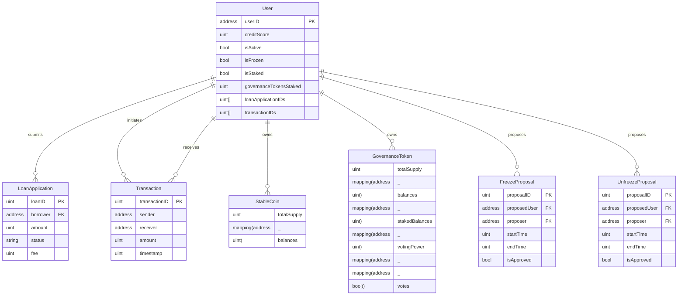
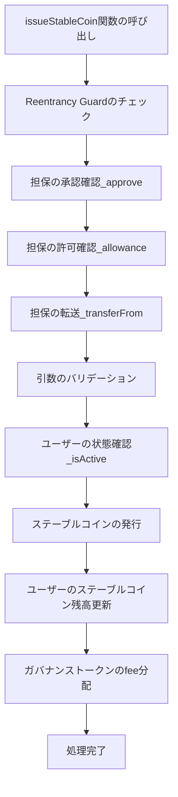
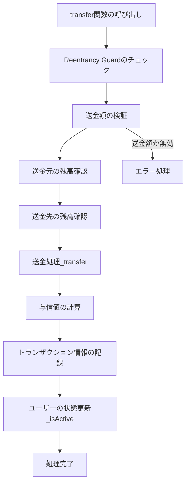
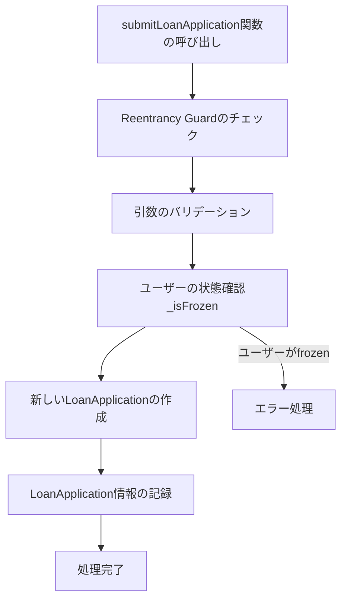
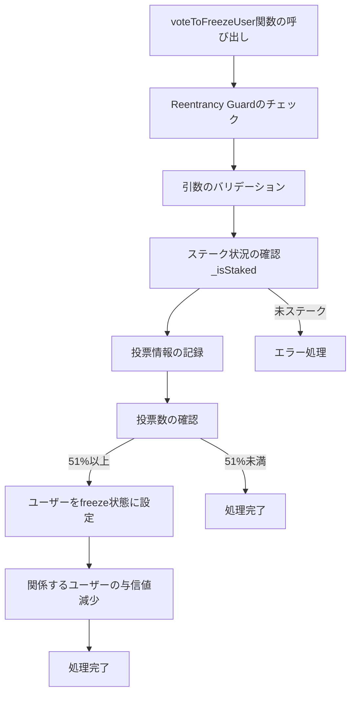
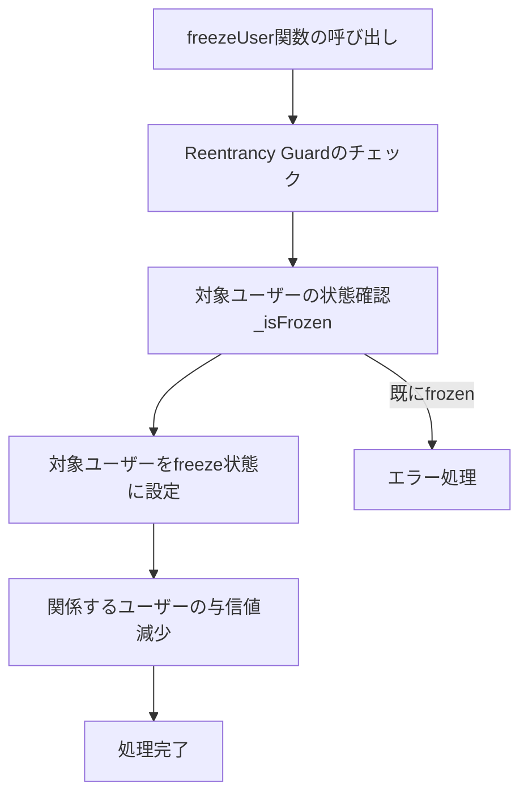
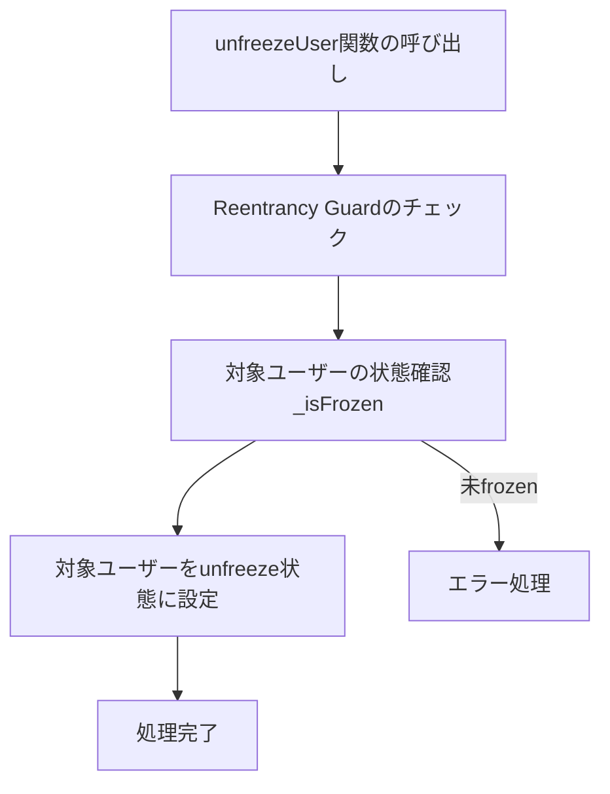

## ER図

## フローチャート
### issueStableCoin関数のフローチャート

### transfer関数のフローチャート

### submitLoanApplication関数のフローチャート

### voteToFreezeUser関数のフローチャート

### freezeUser関数のフローチャート

### unfreezeUser関数のフローチャート

