## ER図
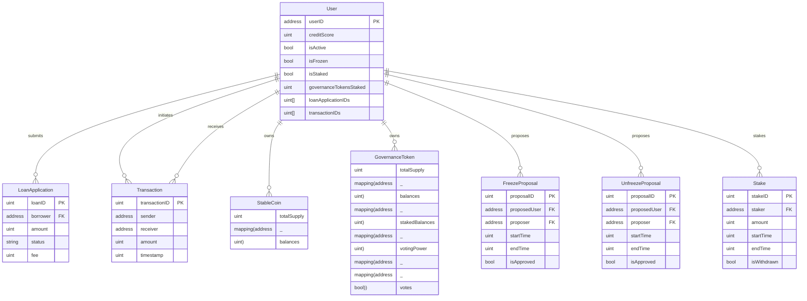

## CDPOperations.sol Functions Flowcharts

### deposit Function
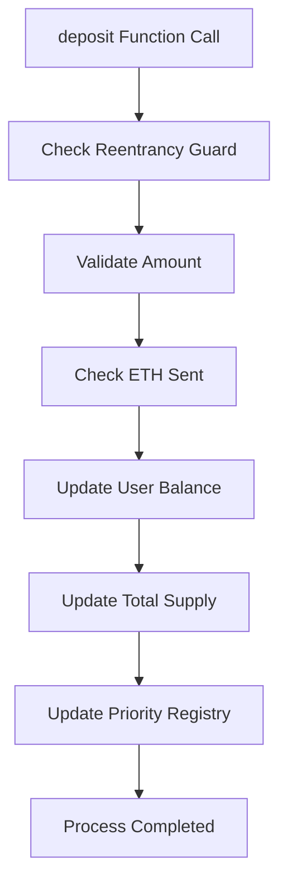

### borrow
```mermaid
flowchart TD
    A[borrow Function Call] --> B[Check Reentrancy Guard]
    B --> C[Validate Amount]
    C --> D[Check User Status (isActive)]
    D --> E[Transfer Collateral (ETH)]
    E --> F[Get Latest ETH Price]
    F --> G[Calculate Max Borrow Amount]
    G --> H[Validate Collateral]
    H --> I[Mint StableCoins]
    I --> J[Update CDP]
    J --> K[Update Priority Registry]
    K --> L[Process Completed]
```

### repay
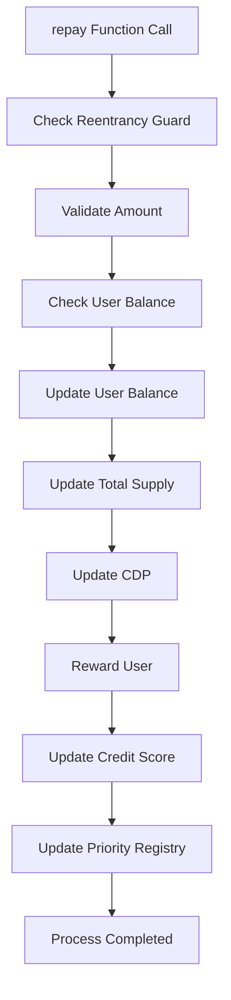

### withdraw
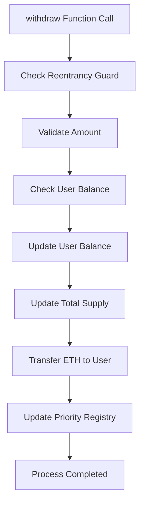

### redeem
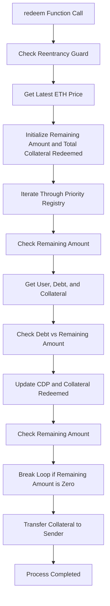

### sweep
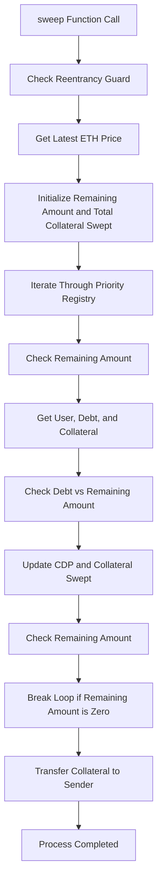

## PriceConsumer
### getLatestPrice
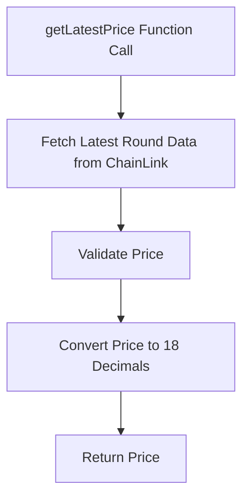
### updateLastGoodPrice
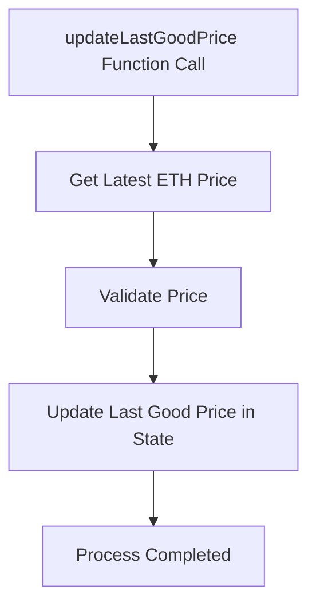


### transfer関数のフローチャート
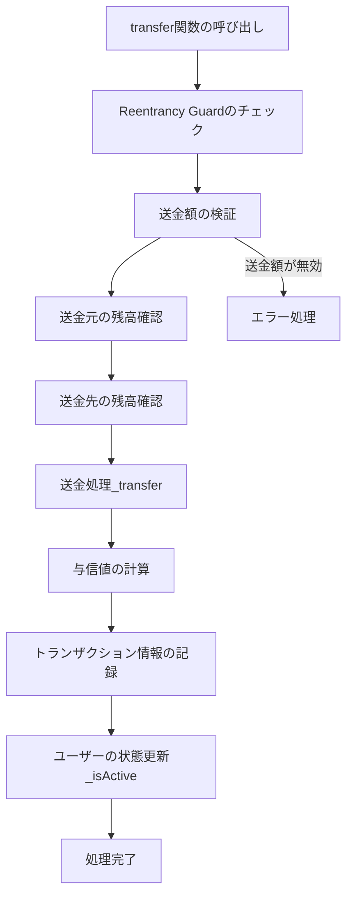

### submitLoanApplication関数のフローチャート
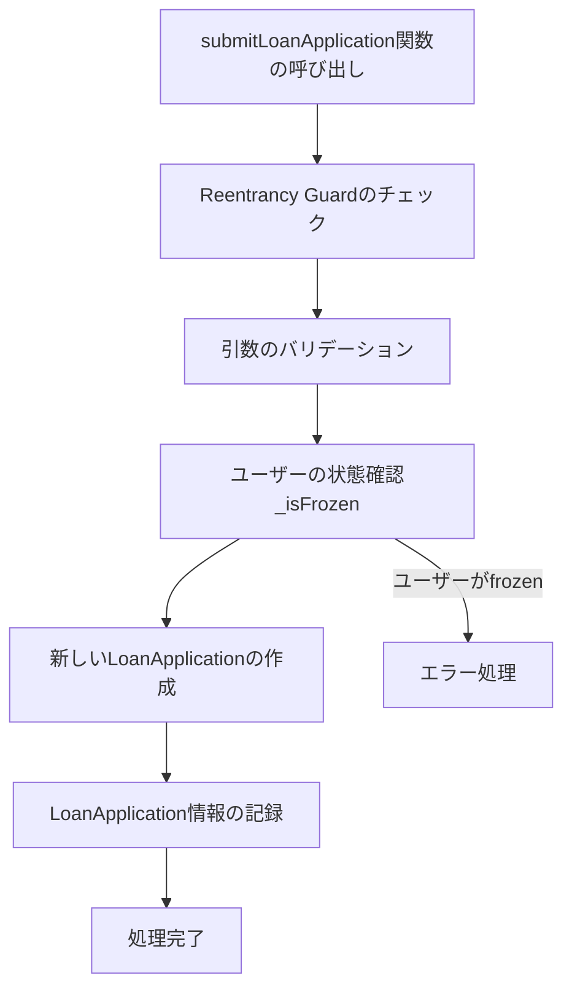

### voteToFreezeUser関数のフローチャート
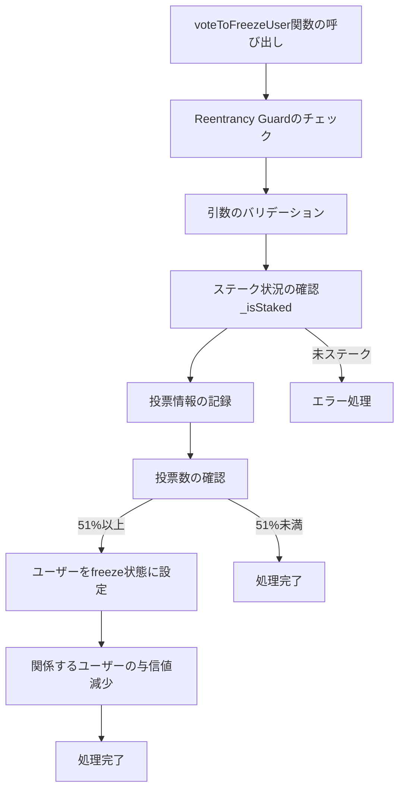

### freezeUser関数のフローチャート
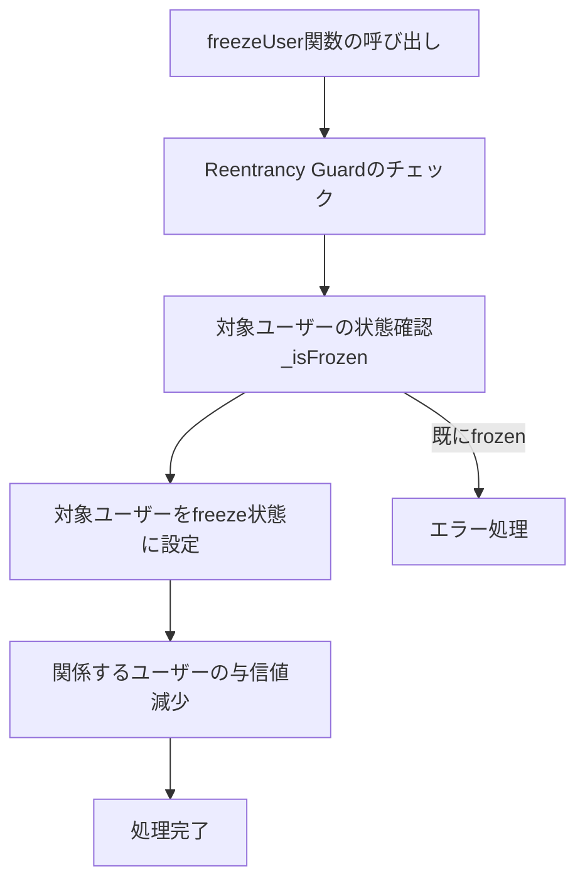

### unfreezeUser関数のフローチャート
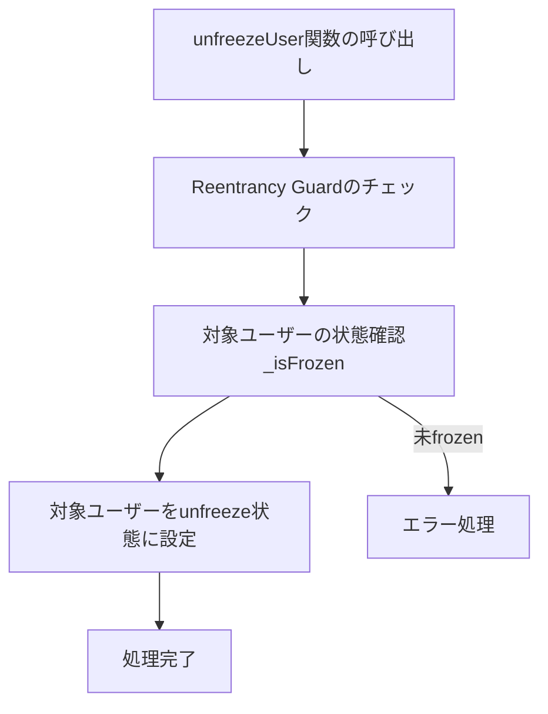

### Lend.solの関数群のフローチャート
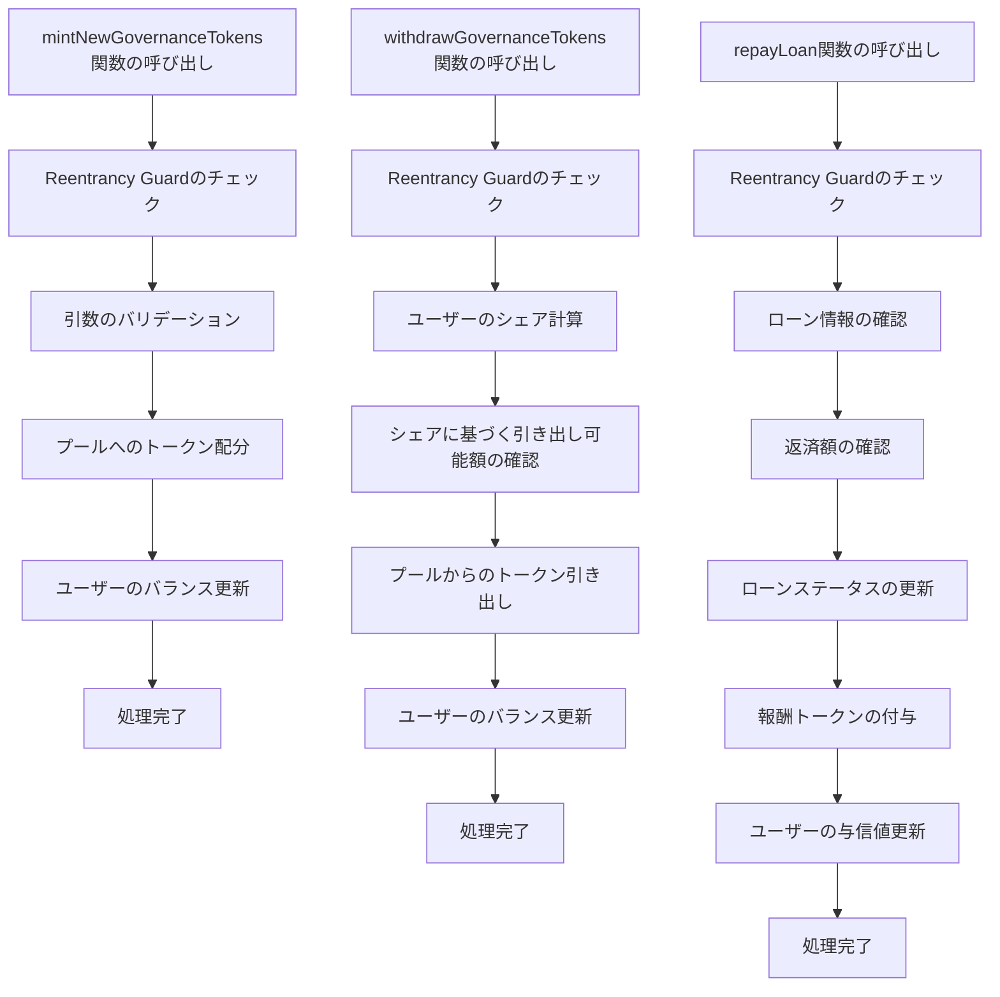

### stakeTokens関数のフローチャート
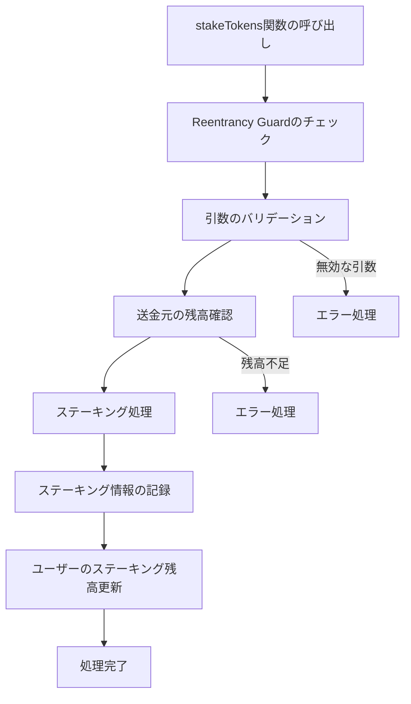

### withdrawStake関数のフローチャート
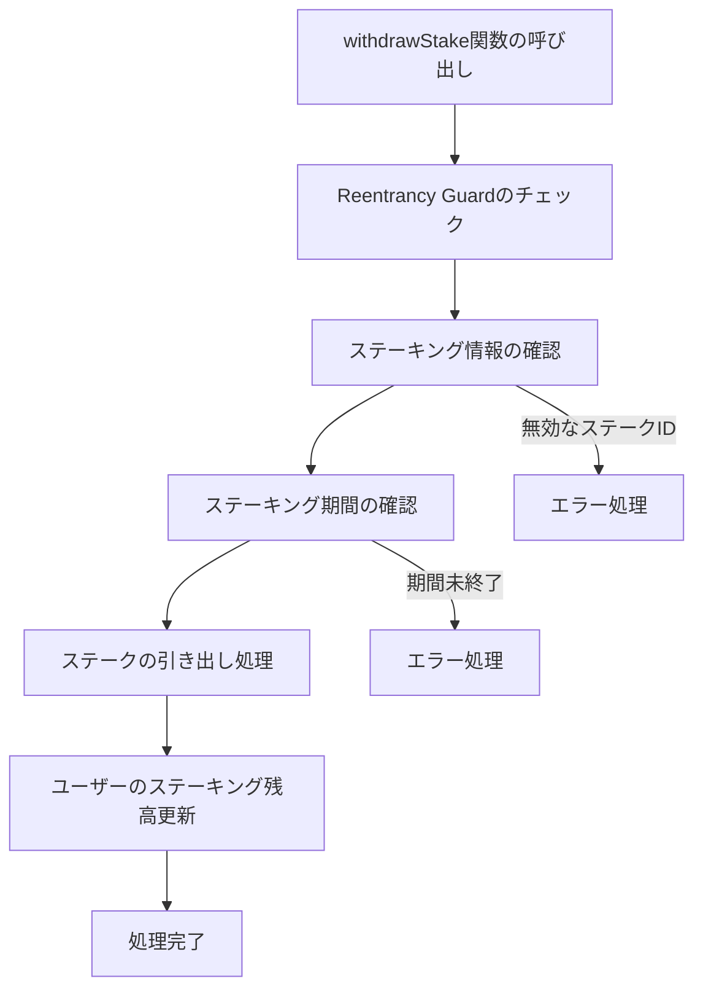
