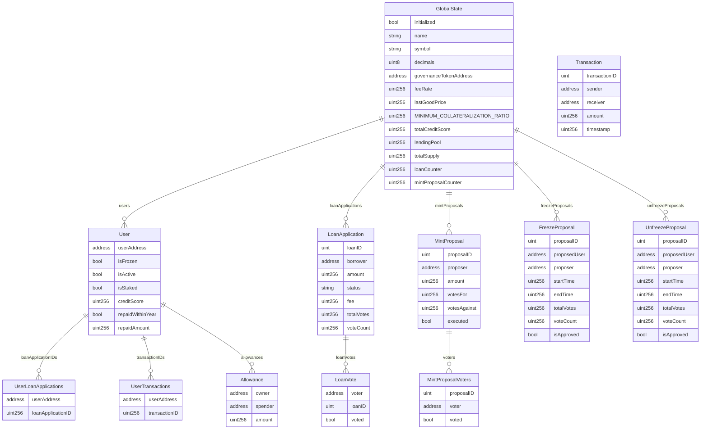

# Main Bundle
## ER図



## CDPOperations.sol Functions Flowcharts
```
flowchart TD
    A[deposit] --> B{amount > 0?}
    B -- Yes --> C{msg.value == amount?}
    C -- Yes --> D[gs.balances＿_user__ += amount]
    D --> E[gs.totalSupply += amount]
    E --> F[_updatePriorityRegistry＿_user__]
    C -- No --> G[Revert with __Incorrect amount of ETH sent__]
    B -- No --> H[Revert with __Invalid amount__]

    subgraph CDPOperations
        A
        B
        C
        D
        E
        F
        G
        H
    end

    I[borrow] --> J{amount > 0?}
    J -- Yes --> K{gs.users＿_borrower__.isActive?}
    K -- Yes --> L{msg.value > 0?}
    L -- Yes --> M[ethPrice = PriceConsumer__address__this____.getLatestPrice____]
    M --> N{ethPrice > 0?}
    N -- Yes --> O[Calculate collateral and maxBorrow]
    O --> P{amount <= maxBorrow?}
    P -- Yes --> Q[gs.balances＿_borrower__ += amount]
    Q --> R[Calculate and deduct fee]
    R --> S[Update CDP]
    S --> T[_updatePriorityRegistry＿_borrower__]
    P -- No --> U[Revert with __Insufficient collateral__]
    N -- No --> V[Revert with __Invalid price__]
    L -- No --> W[Revert with __Insufficient collateral__]
    K -- No --> X[Revert with __User is not active__]
    J -- No --> Y[Revert with __Invalid amount__]

    subgraph CDPOperations
        I
        J
        K
        L
        M
        N
        O
        P
        Q
        R
        S
        T
        U
        V
        W
        X
        Y
    end

    Z[repay] --> AA{amount > 0?}
    AA -- Yes --> AB{gs.balances＿_borrower__ >= amount?}
    AB -- Yes --> AC[gs.balances＿_borrower__ -= amount]
    AC --> AD[gs.totalSupply -= amount]
    AD --> AE[gs.cdps＿_borrower__.debt -= amount]
    AE --> AF[Calculate and add reward]
    AF --> AG[_updatePriorityRegistry＿_borrower__]
    AB -- No --> AH[Revert with __Insufficient balance__]
    AA -- No --> AI[Revert with __Invalid amount__]

    subgraph CDPOperations
        Z
        AA
        AB
        AC
        AD
        AE
        AF
        AG
        AH
        AI
    end
```


### redeem


### sweep


## PriceConsumer
### getLatestPrice

### updateLastGoodPrice


### ERC20Functions関数のフローチャート


### FrozenOperations.sol flowchart


### Lend.solの関数群のフローチャート


# Governance Bundle

## ER図


## Flowchart

### GovernanceT0ken.sol


### Stake.sol
